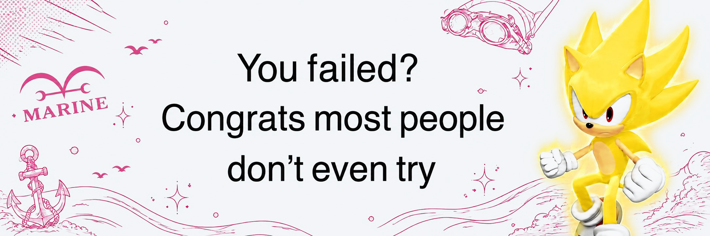

<picture>
  <source media="(prefers-color-scheme: dark)" srcset="banner_dark.png">
  <source media="(prefers-color-scheme: light)" srcset="banner_light.png">
  
</picture>

<h1 align="center">Sunguru</h1>

Ömer Sunguralp Bektaş

  <a href="README.tr.md">🇹🇷 Türkçe</a>

---

## 👋 About Me

AI & Data Engineering student at **Atatürk University** — 21 years old, he/him

> *"No, I'm that Koby! The useless crybaby Koby!"*

---

## 🛠️ Tools & Environment

---

## 🔭 Currently Working On

- 🤖 **a3i — Academic Research Assistant** built on Claude Code
- 📚 Deepening my knowledge in AI & Data Engineering
- 🎨 Occasional pixel art when the code won't cooperate

---

## 🏆 Achievements

| 🥇 | Event | Details |
|----|-------|---------|
| 🏅 **5th Place** | AI Spark Hackathon *(AYZEK — Erzurum)* | Solo entry |

---

## 📜 Certificates

| Certificate | Organization | Location | Year |
|-------------|--------------|----------|------|
| AI Summit Erzurum 2024 — Participation | Atatürk University | Erzurum, TR | 2024 |
| Adventure, Health and Sports: Empowering Youth for Life | FuturEurope Malta / Erasmus+ | Trabzon, TR | 2024 |
| EmpowerHer: Youth Champions for Women's Safety | FuturEurope Malta / Erasmus+ | Trabzon, TR | 2025 |
| Stories That Matter: Exploring Social Issues Through Mystery Box Theater | FuturEurope Malta / Erasmus+ | Trabzon, TR | 2025 |

---

## 📬 Contact

  
  
  
  
  

